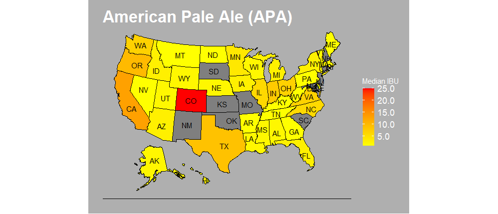
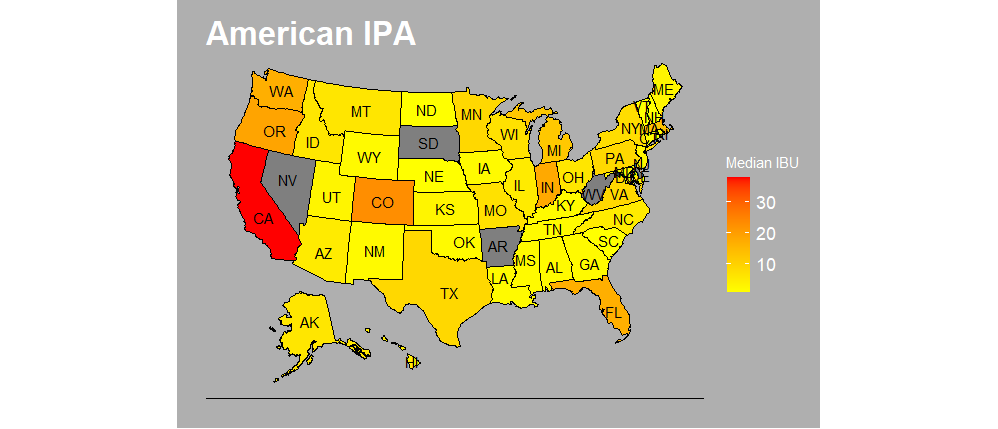

# Beers And Brewery Case Study

## The Datasets
### This study seeks to find insightful and useful information from two data sets. One of the data sets has features that informs characteristics of the beers such as the level of alcohol in the beer (ABV), level of bitterness (IBU), and the beer style. The second data set identifies breweries by the name, city and state where they are located.

### The ABV and IBU of the beers are the features that will drive the study. Unfortunately there are some rows with missing values in those feature. Since they are so valuable for the study, I have decided to remove the rows with missing values before moving forward.

## Exploratory Data Analysis (EDA)

### The first question I seek to answer is how many breweries are there in each state?

  
### The bar plot above shows that California, Oregon and Washington state are amongst the top 6 states with the most breweries in them. That would mean the west coast have a denser concentration of breweries than the east coast. The following heatmap can better illustrate that fact.

### The heat map makes it for a better visualization of the geographical count of breweries. Not only does it show how there is a higher concentration of breweries in the west coast, it also shows that some of the states with the least amount of breweries are in the east coast.

### The next step will be to examine the level of alcohol prefered in each state. For this analysis I will assume that the median value of each beer is the best measurement of center. By getting a good measurement of center, we are getting values that are more likely to happen. With all of that being said, let’s examine the barplot and a heatmap of the median ABV per state.

### First the barplot

### The bar plot shows how the spread of the median alcohol levels by state is not big. This would mean that since those levels of alcohol in a beer are popular in each state, the consumers in each state do seem to agree that perhaps one of the reasons people are buying beers is because of the alcohol content.

### Does the heat map agree with that assessment?

### The ABV heat map does agree with the fact that most states have very similar levels of alcohol in the beers they produce. The interesting thing to see in the heat map is that even though we have seen earlier that there seems to be more breweries in the west coast than in the east coast, the breweries in the east coast seems to specialize in making beers with a little higher alcohol levels than the west coast.

### Now it is time to analyze the IBU content of the beers per state.

### Contrary to the ABV, the IBU bar plot shows that there is more of a difference between the median levels of IBU being produced in each state. Perhaps there is a regional preference for bitterness in the beer.

### Here is the heat map!

### Interestingly, the map again shows that the states that favors a more bitter beer are located in the east coast or near it.

###Next, I will check to see if there is a relationship between ABV and IBU.

### The scatter plot shows a positive correlation. That is to say the more bitter the beer may be the higher the alcohol level. Such is the case with Florida, Georgia, West Virginia, and Maine.

### After observing the bar plots and the heat maps, The conclussion I would make is that though the the west coast has a higher density of breweries, the beers produced in the east coast seems to have higher levels of alcohol and bitterness. The correlation shows that the ABV and IBU have a positive correlation, and that explains the heat maps and the bar plots. In the first bar plot and heat map we can see that there are more breweries in the west coast, and they mostly produce beers with comperatively lower levels of ABV and IBU. The oposite can be seen on the east coast, concluding that the places with least breweries in them tend to produce beers with higher levels of ABV and IBU.

## Machine Learning

### Now I will shift the study to see if machine learning. The machine learning used will be K Nearest Neighbors. The intent will be to see if I can build a model that have a good chance of distiguishing an India Pale Ales (IPA) style of beer from other Ale styles.

### After aranging the data set to use only the ales styles and properly classifying them as IPA or Other, I will begin the process of building the model. First, though, a scatter plot should demonstrate a if there is separation between the Ale groups (IPA and Other).

### The scatter plot shows that there is a quite visible separation between the IPA and the other types of Ales because the IPAs seem to have higher levels of both the ABV and IBU. With that in mind, let me now build the knn model.

### An optimal model was created and yielded the following scores:

### * Accuracy: 92%
### * Sensitivity: 89%
### * Specificity: 94%

### The accuracy looks really good at 92%, with the sensitivity and specificity being 89% and 94% respectively. This indicates that the model is quite accurate and its ability to classify what is not an IPA into Other is what helps. In other words, it is able to classify IPA with a nice rate of accuracy without trying to overfit the Ales that are not IPAs.

## Additional Observation

### Additionally, I decided to study the top styles of beers and what opportunities they may provide. First I wanted to see how many total styles there is.  The answer is 91 total styles.

### From the 91 different styles of beers, I will see which styles are the 10 most popular by checking how many different beers there are for each style. After that, I will plot them comparing it to the other 81 styles in terms of popularity. Popularity in this case being the amount of beers being produced with each of the styles.

### The top 10 styles of beers are more popular than the remainder 81! This means there are more beers under the top 10 styles than there are under 81 other styles. Now it is time to check which of the 10 styles is more popular and their ABV and IBU levels.

### Of the top 10 styles the most popular being the American IPA, which has over 20% of the total beers. The American Pale Ale (APA) has over 10%, which means over one third of the beers produced are either American IPA and American Pale Ale (APA). If Budweiser is considering getting in the Ale market, The American Pale Ale or the American IPA are two styles that are quite popular in the U.S.

### Now to check their popularity in each specific state with the heat map.

### Though the American Pale Ale is the most popular style, states like New Mexico, Oklahoma and South Carolina do not seem to have many beers of that style being produced there. While for the American IPA Nevada and Arkansa seem to be good options to introduce a new product line.

## Thank you for your attention! It was a great pleasure to work with these data sets, and I look forward to more! In the mean time I am open to explain any point of confusion, just reach out.

